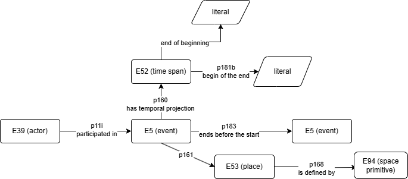

# MB_annotations_extractor

The goal is using LLM (Claude Sonnet 3.5 latest and GPT4) to generate complete RDF annotations for places and dates extracted from diary pages, structured around an event container representing the time and location associated with Mary Berenson. This container follows a specific data model.

 
Two approaches were considered to achieve this:
1) The first approach involved directly extracting places and dates from the diary text and generating RDF files in .trig format using a predefined template. However, this method lead to inconsistencies, such as incorrect UUID generation, and incompleteness, often failing to capture all the places mentioned in the text. 
2) The second, more reliable approach uses a step-by-step process where the necessary data is first extracted into JSON format. This involves identifying details such as place names, UUIDs linked to the places, coordinates, Wikidata entities, and their positions in the text. Similar extraction is performed for dates. Additional UUIDs, including those for events and creation dates, are generated using UUID library to ensure consistency. The extracted data is then substituted into a standard .trig template.

Creating an event container requires combining the extracted time and place information, referencing previously generated .trig files, and contextual details from the diary entries. To ensure chronological continuity, the process includes linking each event to the next, even if the subsequent event is described in a different diary file. This step relies on examining related entries, up to five files in chronological order, to maintain the sequence. The resulting event JSON includes UUIDs for places and times, a newly generated UUID for the event, and another UUID linking the event to the next one in the timeline. This approach ensures that the RDF annotations comply with the OA schema and that the event container adheres to the prescribed data model.

A supplementary script refines and validates Wikidata IDs generated by a Large Language Model (LLM). It accesses the Wikidata SPARQL endpoint to retrieve a list of potential matches based on the provided label. For disambiguation, the system utilizes GPT-4, incorporating contextual information such as coordinates previously extracted by the LLM. It specifically targets geospatial entities, including countries, cities, villages, buildings, museums, and cultural heritage sites. Once the correct entity is identified, the script substitutes the disambiguated Wikidata ID back into the original TRiG file, ensuring consistency and accuracy.

Unsolved problems:
- some wikidata ids are not disambiguated
- temporal entities not defined completely with day/month/year, such as "the next day", "monday", "yesterday" are not correctly located in time when the date annotation is created. 

